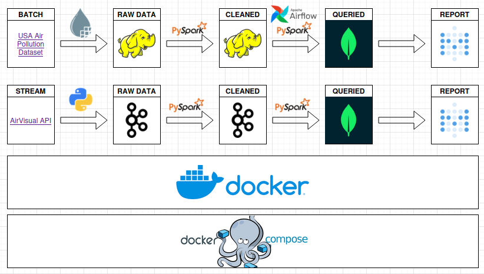

# Big Data Engineering - Air Quality Analysis 2025

  
  

         

    

    

   

   

    

  

      

 

## About the Project

**Course:** Architectures and Systems for Big Data  
**Student:** Matija Maksimović  
**Project Title:** Air Quality Analysis  

The goal of this project is to analyze air quality data using two processing modes:
- **Batch Processing:** Historical air quality data from USA is used. (A total of **10 queries** are performed)
  [USA Air Pollution Dataset](https://www.kaggle.com/datasets/mexwell/us-air-pollution)
- **Streaming Processing:**  Real-time pollution and weather sensor data from USA [California, Texas, Illinois, Pennsylvania, Utah] is used. (A total of **5 queries** are performed)
  [AirVisual API](https://api-docs.iqair.com/#get-started)

## Cleaned Data Structure

### Batch Data:

- **Pollutants:** `NO2 [ppb]`, `O3 [ppm]`, `SO2 [ppb]`, `CO [ppm]`  
  Each pollutant has the following columns:
  - `Max Value (In a day)`, `Max Hour (The hour when max value was measured)`, `Mean`, `AQI`

- **Location and Time Fields:**
  - `State`, `County`, `City`, `Monitoring Site`
  - `Date`

### Streaming Data:

- **Location, Timestamp and Readings:**
  - `State, City, Timestamp`
  - `AQI, Pollutant (P10 or P2.5)`
  - `Temperature (°C), Air Pressure (hPa), Humidity (%), Wind Speed (m/s), Wind Direction (°)`
                 
## Technologies

- **Docker**: Containerization platform used for deploying and running the application.  
- **MongoDB**: NoSQL database used for storing transformed data.  
- **Python**: The programming language used to develop the application.  
- **HDFS**: Hadoop Distributed File System for scalable and reliable data storage.  
- **Apache Airflow**: Workflow orchestration tool used for data pipelines.  
- **Apache Kafka**: Distributed streaming platform used for real-time data.  
- **Apache NiFi**: Data integration tool used for automating data flow between systems.  
- **Apache Spark**: Unified analytics engine for large-scale data processing.
- **Metabase**: Open-source business intelligence tool used for visualizing and analyzing data.

## System Architecture

## Queries

**BATCH:**

1. Get the number of unique monitoring locations by state.
2. Get the global NO2 mean value.
3. List the top 5 cities with the highest AQI for O3.
4. What is the average AQI for pollutants (NO2, O3, SO2, CO) in each state?
5. Identify cities with highest combined AQI in winter.
6. Show how highest measured daily pollutant values changed over time.
7. Find the most common hour where the maximum measured values occurred in each county.
8. Rank cities based on the standard variation of measured daily AQI values using a sliding window.
9. Ranking countries based on the linear regression trend for NO2 AQI.
10. Identifying seasonal patterns in monthly pollutant concentrations.

**STREAM:**

1. Detect sudden AQI spikes.
2. Make high temperature alert.
3. Detect low humidity.
4. Detect strong wind events.
5. Get AQI windowed average.

## 📝 BONUS: A Paper on CRDTs
For a detailed exploration of Conflict-Free Replicated Data Types (CRDTs), refer to the seminar paper inside this repository. This paper discusses the theoretical foundations and practical applications of CRDTs, highlighting their significance in distributed systems, ensuring consistency without the need for synchronization.

You can find the paper in the following directory:  
`seminar-paper/CRDT.pdf`.

**Disclaimer**: The paper is written in Serbian 🇷🇸

